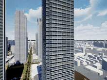
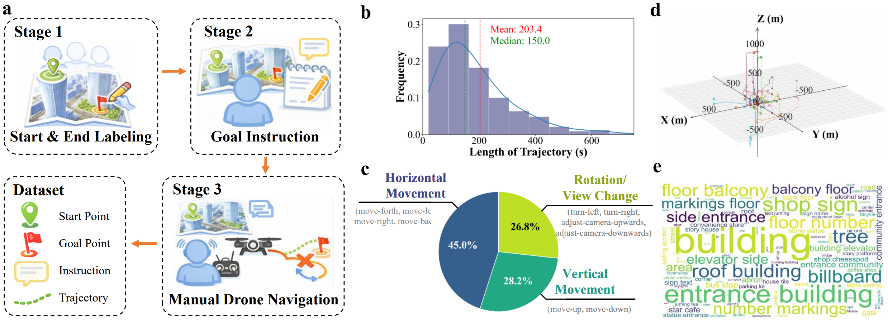
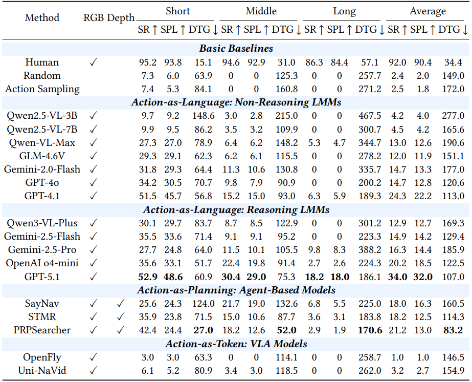

# Can Large Multimodal Models Achieve Human-like Spatial Action? A Benchmark for Goal-Oriented Embodied Navigation in Urban Airspace

## Abstract

Large multimodal models (LMMs) show strong visual–linguistic reasoning but their capacity for human-like spatial decision-making and action remains unclear. In this work, we investigate whether LMMs can achieve embodied spatial action like human through a challenging scenario—goal-oriented navigation in urban 3D spaces. We introduce a large-scale benchmark comprising 5,037 high-quality trajectories and natural language goals, collected via human-controlled flights in a photorealistic aerial simulator. This benchmark features rich urban semantics and a wide action space, enabling rigorous evaluation of LMMs' embodied navigation competence. We comprehensively assess 17 representative models, including non-reasoning LMMs, reasoning LMMs, agent-based methods, and vision-language-action models. Our analysis shows that current LMMs exhibit emerging action capabilities, yet remain far from human-level performance. We further identify four promising directions for improvement: geometric perception, cross-view understanding, spatial imagination, and long-term memory.

---

## Dataset Overview

### Navigation Example

|                             Example 1                             |                             Example 2                             |                              Example 3                              |
| :---------------------------------------------------------------: | :---------------------------------------------------------------: | :------------------------------------------------------------------: |
|                     *Goal: Nearby bus stop*                     |        *Goal: The fresh food shop in the building below*        | *Goal: The balcony on the 20th floor of the building on the right* |
|  |  |  |

> **Note**: The videos above demonstrate goal-oriented embodied navigation examples in urban airspace. Given linguistic instructions, the task evaluates the ability to progressively act based on continuous embodied observations to approach the goal location.

### Dataset Statistics

**Key Statistics:**

- **Total Trajectories**: 5,037 high-quality goal-oriented navigation trajectories
- **Data Collection**: Over 500 hours of human-controlled data collection
- **Average Trajectory Length**: ~175.2 meters
- **Average Actions per Trajectory**: 27.9 actions
- **Annotators**: 10 volunteers (5 for case creation, 5 experienced drone pilots with 100+ hours flight experience)
- **Target Distance Range**: Within 300 meters to align with real-world drone logistics applications
- **Action Types**:
  - Horizontal movement (move-forth, move-left, move-right, move-back)
  - Vertical movement (move-up, move-down)
  - Rotation (turn-left, turn-right)
  - Camera gimbal adjustment (adjust-camera-gimbal-upwards, adjust-camera-gimbal-downwards)
- **Trajectory Distribution**: Uniform horizontal directions; more frequent downward movements (aligning with practical drone navigation)

**Statistics Visualization:**

*Figure: a. The length distribution of navigation trajectories. b. Frequency statistics of action counts in navigation trajectories. c. The relative position of trajectories to the origin. d. Proportion of various types of actions. e. Word cloud of goal instructions.*

---

## Experimental Results

### Quantitative Results

We evaluate 17 representative models across five categories: Basic Baselines, Non-Reasoning LMMs, Reasoning LMMs, Agent-Based Approaches, and Vision-Language-Action Models.

> **Note**: Short, Middle, and Long groups correspond to ground truth trajectories of <118.2m, 118.2-223.6m, and >223.6m respectively. SR = Success Rate, SPL = Success weighted by Path Length, DTG = Distance to Goal.