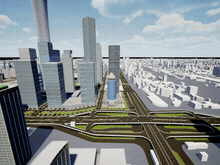
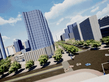
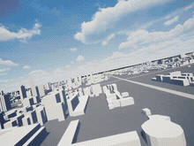
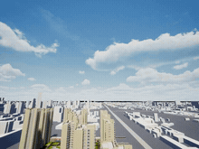
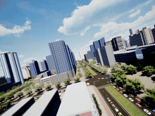
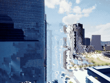
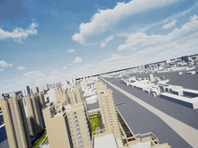

# How Far Are Large Multimodal Models from Human-Level Spatial Action? A Benchmark for Goal-Oriented Embodied Navigation in Urban Airspace

[](https://arxiv.org/html/2604.07973v1)
[](https://huggingface.co/datasets/EmbodiedCity/EmbodiedNav-Bench)

## Abstract

Large multimodal models (LMMs) show strong visual-linguistic reasoning but their capacity for spatial decision-making and action remains unclear. In this work, we investigate whether LMMs can achieve embodied spatial action like human through a challenging scenario: goal-oriented navigation in urban 3D spaces. We first spend over 500 hours constructing a dataset comprising 5,037 high-quality goal-oriented navigation samples, with an emphasis on 3D vertical actions and rich urban semantic information. Then, we comprehensively assess 17 representative models, including non-reasoning LMMs, reasoning LMMs, agent-based methods, and vision-language-action models. Experiments show that current LMMs exhibit emerging action capabilities, yet remain far from human-level performance. Furthermore, we reveal an intriguing phenomenon: navigation errors do not accumulate linearly but instead diverge rapidly from the destination after a critical decision bifurcation. The limitations of LMMs are investigated by analyzing their behavior at these critical decision bifurcations. Finally, we experimentally explore four promising directions for improvement: geometric perception, cross-view understanding, spatial imagination, and long-term memory.

---

## Dataset Overview

The videos above demonstrate goal-oriented embodied navigation examples in urban airspace. Given linguistic instructions, the task evaluates the ability to progressively act based on continuous embodied observations to approach the goal location.

<table border="1" cellspacing="0" cellpadding="8">
  <thead>
    <tr>
      <th align="center">Index</th>
      <th align="center">Goal</th>
      <th align="center">Video (Speed Up)</th>
    </tr>
  </thead>
  <tbody>
    <tr>
      <td align="center">1</td>
      <td>Nearby bus stop</td>
      <td align="center"><a href="video/1.mp4"></a></td>
    </tr>
    <tr>
      <td align="center">2</td>
      <td>The fresh food shop in the building below</td>
      <td align="center"><a href="video/2.mp4"></a></td>
    </tr>
    <tr>
      <td align="center">3</td>
      <td>The balcony on the 20th floor of the building on the right</td>
      <td align="center"><a href="video/3.mp4"></a></td>
    </tr>
    <tr>
      <td align="center">4</td>
      <td>The helipad on the rooftop below</td>
      <td align="center"><a href="video/4.mp4"></a></td>
    </tr>
    <tr>
      <td align="center">5</td>
      <td>The table at the entrance of the yellow-roofed restaurant below</td>
      <td align="center"><a href="video/5.mp4"></a></td>
    </tr>
    <tr>
      <td align="center">6</td>
      <td>The residential area gate between the two buildings below</td>
      <td align="center"><a href="video/6.mp4"></a></td>
    </tr>
    <tr>
      <td align="center">7</td>
      <td>The restaurant with the red sign below</td>
      <td align="center"><a href="video/7.mp4"></a></td>
    </tr>
    <tr>
      <td align="center">8</td>
      <td>The way into the residential complex next to the coffee shop</td>
      <td align="center"><a href="video/8.mp4"></a></td>
    </tr>
    <tr>
      <td align="center">9</td>
      <td>Two stone lions nearby</td>
      <td align="center"><a href="video/9.mp4"></a></td>
    </tr>
    <tr>
      <td align="center">10</td>
      <td>The nearest entrance to the residential complex below</td>
      <td align="center"><a href="video/10.mp4"></a></td>
    </tr>
  </tbody>
</table>


### Dataset Statistics

**Key Statistics:**

- **Total Trajectories**: 5,037 high-quality goal-oriented navigation trajectories
- **Data Collection**: Over 500 hours of human-controlled data collection
- **Annotators**: 10 volunteers (5 for case creation, 5 experienced drone pilots with 100+ hours flight experience)
- **Action Types**: 6 DoF, Continuous or Discrete
- **Trajectory Distribution**: Pay more attention to vertical movement

**Dataset Construction and Statistical Visualization:** 


*Figure: a. Dataset Construction Pipeline. b. The length distribution of navigation trajectories. c. Proportion of various types of actions. d. The relative position of trajectories to the origin. e. Word cloud of goal instructions.*

---

## Environment Setup and Simulator Deployment

This project references [EmbodiedCity](https://github.com/tsinghua-fib-lab/EmbodiedCity) for the urban simulation environment.

### 1. Download the simulator

- Offline simulator download (official): [EmbodiedCity-Simulator on HuggingFace](https://huggingface.co/datasets/EmbodiedCity/EmbodiedCity-Simulator)
- Download and extract the simulator package, then launch the provided executable (`.exe`) and keep it running before evaluation.

### 2. Create the Python environment

Use one of the following ways:

```bash
conda create -n EmbodiedCity python=3.10 -y
conda activate EmbodiedCity
pip install airsim openai opencv-python numpy pandas
```

If you are using the simulator package's built-in environment files:

```bash
conda env create -n EmbodiedCity -f environment.yml
conda activate EmbodiedCity
```

### 3. Dataset release

The full EmbodiedNav-Bench release comprises **5,037 high-quality, goal-oriented navigation trajectories**. To keep the code repository lightweight and ensure a single canonical data source, all dataset artifacts are distributed through the Hugging Face dataset repository:

[](https://huggingface.co/datasets/EmbodiedCity/EmbodiedNav-Bench)

The Hugging Face repository is the canonical data release location. This GitHub repository focuses on simulator setup, evaluation code, and project documentation.

Data files in the Hugging Face repository:

| File | Purpose |
| :-- | :-- |
| `navi_data.pkl` | Canonical PKL file for evaluation. |
| `viewer-00000-of-00001.parquet` | Parquet representation for the Hugging Face Dataset Viewer table. |

The Parquet file is provided for the Hugging Face Table view. Use `dataset/navi_data.pkl` as the canonical file for evaluation.

Before running the local evaluator, download the canonical PKL file from Hugging Face to `dataset/navi_data.pkl` under the project root.

#### 3.1 `navi_data.pkl` field schema

Each sample in the canonical `dataset/navi_data.pkl` file is a Python `dict` with the following fields:

| Field | Type | Description |
| :-- | :-- | :-- |
| `sample_index` | `int` | Case index. |
| `start_pos` | `float[3]` | Initial drone world position `(x, y, z)` |
| `start_rot` | `float[3]` | Initial drone orientation `(roll, pitch, yaw)` in radians |
| `start_ang` | `float` | Initial camera gimbal angle (degrees) |
| `task_desc` | `str` | Natural-language navigation instruction |
| `target_pos` | `float[3]` | Target world position `(x, y, z)` |
| `gt_traj` | `float[N,3]` | Ground-truth trajectory points |
| `gt_traj_len` | `float` | Ground-truth trajectory length |

#### 3.2 Example item

```json
{
  "sample_index": 0,
  "task_desc": "the entrance of the red building on the left front",
  "start_pos": [6589.18164, -4162.23877, -36.2995872],
  "start_rot": [0.0, 0.0, 3.14159251],
  "start_ang": 0.0,
  "target_pos": [6390.7041, -4154.58545, -6.29958725],
  "gt_traj_len": 229.99981973603806,
  "gt_traj_num_points": 28,
  "gt_traj_preview_first5": [
    [6589.18164, -4162.23877, -36.2995872],
    [6579.18164, -4162.23877, -36.2995872],
    [6569.18164, -4162.23877, -36.2995872],
    [6559.18164, -4162.23877, -36.2995872],
    [6549.18164, -4162.23877, -36.2995872]
  ]
}
```

### 4. How to test your own model

To evaluate your model, modify the Agent logic in [`embodied_vln.py`](./embodied_vln.py), mainly in the `ActionGen` class:

- `ActionGen.query(...)`: replace prompt design / model API call / decision logic.
- Keep output command format compatible with `parse_llm_action(...)` (one command per step).
- Supported commands include: `move_forth`, `move_back`, `move_left`, `move_right`, `move_up`, `move_down`, `turn_left`, `turn_right`, `angle_up`, `angle_down`.

Then run:

```bash
python embodied_vln.py
```

**Example: connect other API models**

Use the API placeholder pattern in `embodied_vln.py` as a template for plugging in your own model service.

Current placeholders (in `embodied_vln.py`) are:

- `AZURE_OPENAI_MODEL`
- `AZURE_OPENAI_API_KEY`
- `AZURE_OPENAI_ENDPOINT`
- `AZURE_OPENAI_API_VERSION` (optional, default: `2024-07-01-preview`)

PowerShell example:

```powershell
$env:AZURE_OPENAI_MODEL="your-deployment-name"
$env:AZURE_OPENAI_API_KEY="your-api-key"
$env:AZURE_OPENAI_ENDPOINT="https://your-resource-name.openai.azure.com/"
$env:AZURE_OPENAI_API_VERSION="2024-07-01-preview"
```

If you use a non-Azure model API, keep this contract unchanged:

- `ActionGen.query(...)` must return one text command each step.
- Returned command should still be compatible with `parse_llm_action(...)`.

Minimal expected return format:

```text
Thinking: <your model reasoning>
Command: move_forth
```

---

## Experimental Results

### Quantitative Results

We evaluate 17 representative models across five categories: Basic Baselines, Non-Reasoning LMMs, Reasoning LMMs, Agent-Based Approaches, and Vision-Language-Action Models.

Short, Middle, and Long groups correspond to ground truth trajectories of <118.2m, 118.2-223.6m, and >223.6m respectively. SR = Success Rate, SPL = Success weighted by Path Length, DTG = Distance to Goal.

## Citation

```bibtex
@misc{zhao2026farlargemultimodalmodels,
      title={How Far Are Large Multimodal Models from Human-Level Spatial Action? A Benchmark for Goal-Oriented Embodied Navigation in Urban Airspace},
      author={Baining Zhao and Ziyou Wang and Jianjie Fang and Zile Zhou and Yanggang Xu and Yatai Ji and Jiacheng Xu and Qian Zhang and Weichen Zhang and Chen Gao and Xinlei Chen},
      year={2026},
      eprint={2604.07973},
      archivePrefix={arXiv},
      primaryClass={cs.AI},
      url={https://arxiv.org/html/2604.07973v1},
}
```
